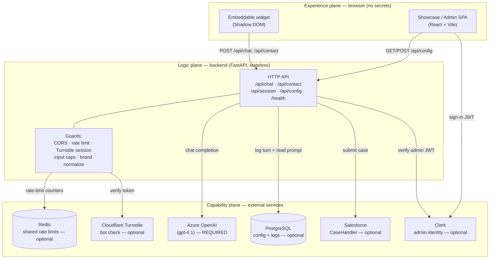

# 01 · Product Architecture

> **Audience:** Mixed (technical and non-technical). The high-level view of the
> whole system — what it is, how responsibilities are divided, the principles that
> govern it, and how it grows.
> **Last reviewed:** 2026-06-18 · **Owner:** AI Lab (ncr4ailab.de)

Unfamiliar terms are defined in the [Glossary](00-glossary.md).

---

## 1. High-level overview

Navio is a **website chat assistant for SportNavi** (Germany's corporate-fitness
network). It is composed of three planes:

1. **Experience plane (frontend)** — the chat bubble and admin website the user
   sees. Holds no secrets.
2. **Logic plane (backend)** — a stateless server that holds the secrets, applies
   all safety rules, and orchestrates the AI engine and external systems.
3. **Capability plane (external services)** — the AI engine and business systems
   the backend calls: Azure OpenAI, PostgreSQL, Salesforce, Clerk, Cloudflare
   Turnstile, and Redis.

### Two product personas, one brain

Navio ships as **two configured bots** (see `frontend/src/data/bots.ts`), both
served by the same backend and AI engine:

| Bot            | `flow`   | Experience                                                                                  |
| -------------- | -------- | ------------------------------------------------------------------------------------------- |
| **Navio**      | `chat`   | Consent → straight into the FAQ chat.                                                        |
| **Navio Plus** | `menu`   | Consent → a small menu: chat with the FAQ agent **or** complete a contact form into Salesforce. |

Both bots target three audiences — **members**, **companies**, and **partners** —
and reply in the visitor's own language, grounded only in SportNavi's official
knowledge base (`backend/prompts/SYSTEM_PROMPT.md`).

---

## 2. Master system diagram

> A plain-language version of this diagram is in the
> [Executive Summary](00-executive-summary.md#4-how-it-works-at-a-glance).

---

## 3. Separation of responsibilities

Clear ownership is the backbone of a maintainable system. Each layer owns a narrow
set of concerns and explicitly does **not** own others.

| Layer / Service       | Owns (responsible for)                                                                 | Does **not** own                                              |
| --------------------- | -------------------------------------------------------------------------------------- | ------------------------------------------------------------ |
| **Frontend**          | Presentation, consent gate UX, input collection, calling the API, rendering replies     | Secrets, AI calls, business rules, data storage              |
| **Backend**           | Secrets, system prompt injection, AI orchestration, safety guards, logging, integrations | UI rendering, long-term identity, model hosting              |
| **Azure OpenAI**      | Generating answer text from the prompt + history                                        | Knowledge curation, safety policy, persistence               |
| **PostgreSQL**        | Persisting the editable prompt + consent-gated conversation log                          | Business logic, leads/bookings (deliberately stores neither) |
| **Salesforce**        | Creating support cases from the contact form                                            | Chat, identity                                               |
| **Clerk**             | Admin sign-in and identity (issuing/verifying JWTs)                                      | Chat visitor identity (visitors are anonymous)               |
| **Cloudflare Turnstile** | Proving a real browser before a chat session                                         | Authorization, rate limiting                                 |
| **Redis**             | Sharing rate-limit counters across backend instances                                    | Durable storage (counters are disposable)                    |

**Key boundary:** the **AI key and the system prompt live only in the backend** —
never in the browser (`backend/app.py` header comment). This single rule shapes
much of the architecture.

---

## 4. Core design principles (decision + justification)

Each principle below is a deliberate decision, with the reasoning that justifies it.

### 4.1 Secrets server-side only
**Decision:** The Azure key, system prompt, Salesforce credentials, Clerk secret,
and database URL exist only in the backend.
**Why:** Anything shipped to a browser is public. Keeping secrets server-side is the
difference between a controlled service and a leaked key. It also lets the prompt
and knowledge base be edited centrally without redeploying the frontend.

### 4.2 Stateless backend
**Decision:** The backend holds no per-user session memory; the browser sends recent
chat history with every `/api/chat` request (`ChatRequest.history`, capped at 10
turns).
**Why:** Statelessness means any instance can serve any request, so the service
scales horizontally and "to zero" with no sticky sessions or shared memory. Editable
config and logs live in the database, not in instance memory.

### 4.3 Consent-first privacy
**Decision:** The widget shows a Datenschutz gate before any message; message **text**
is stored only when the visitor consents, and IP addresses are stored only as
irreversible hashes (`backend/app.py` `_log_row`, `backend/db.py` `hash_ip`).
**Why:** GDPR/DSGVO compliance for a German audience, and basic respect for users.
Without consent, only anonymous metrics are kept — enough to monitor health, nothing
that identifies a person.

### 4.4 Graceful degradation of optional integrations
**Decision:** Database, Salesforce, Clerk, Turnstile, and Redis are all **optional**.
Each module exposes an `*_enabled()` check and safely no-ops or simulates when
unconfigured.
**Why:** The app boots and chats with only the AI key configured. This makes local
development trivial, demos safe, and partial outages non-fatal (e.g. a Salesforce
failure falls back to email; a missing database simply disables logging). See the
[graceful-degradation matrix](02-backend-architecture.md#3-service-boundaries--graceful-degradation).

### 4.5 Multi-language by default
**Decision:** Navio detects the visitor's language per message and replies in it
(system prompt rule), with no UI language switch.
**Why:** SportNavi serves a diverse audience; forcing a language choice adds friction.
The model already handles this well when instructed.

### 4.6 Abuse resistance and cost control
**Decision:** Layered defenses — CORS allowlist, per-IP rate limits (minute + day),
strict input caps, optional Turnstile + signed session tokens, and graceful mapping
of AI content-filter errors to a friendly reply.
**Why:** A public AI endpoint is a target for scraping and abuse, each call costs
money. These limits protect both the budget and the user experience (no scary 500s).

### 4.7 Embeddability
**Decision:** The chat ships as a standalone widget that any SportNavi page loads
with one `<script>` tag and that seals itself in a Shadow DOM
(`frontend/src/embed/widget.tsx`).
**Why:** SportNavi can add Navio to any page without rebuilding it, and the widget
renders correctly regardless of the host page's CSS. The backend URL is derived from
the script's origin, so the embed "just works" wherever it is hosted.

---

## 5. Scalable & maintainable system design

- **Horizontal scale** comes from statelessness (§4.2): add instances freely; Redis
  keeps rate limits consistent across them.
- **Configuration over redeploy:** the system prompt is edited via the admin API and
  stored in the database, picked up by every instance within a short TTL
  (`CONFIG_TTL_SEC`, default 30s) — no redeploy to change Navio's behaviour.
- **Single source of bot definitions:** `frontend/src/data/bots.ts` is the one place
  that defines each bot's persona, greeting, quick replies, and contact-form options
  — adding a bot is data, not new code paths.
- **Narrow, well-named modules:** backend logic is split by concern
  (`app.py`, `db.py`, `salesforce.py`, `clerk_auth.py`), each independently optional.

---

## 6. Where complexity intentionally lives

| Complexity                     | Lives in            | Why there                                                              |
| ------------------------------ | ------------------- | --------------------------------------------------------------------- |
| Safety, secrets, orchestration | Backend             | The only trusted environment.                                         |
| AI behaviour & knowledge       | System prompt (data)| Editable without code changes; reviewable by non-engineers.           |
| Persona & UX copy              | `bots.ts` (data)    | Product/marketing can adjust without touching logic.                  |
| Presentation only              | Frontend components | Keeps the UI replaceable and the logic testable in isolation.         |

---

## 7. Future growth considerations

These are forward-looking notes, **not commitments** — captured so today's decisions
don't block tomorrow's options.

| Growth area                     | Today                                                       | Possible next step                                                                 |
| ------------------------------- | ---------------------------------------------------------- | ---------------------------------------------------------------------------------- |
| **More bots**                   | Two bots in `bots.ts`, one backend                         | Add bots as data; optionally per-bot system prompts in `bot_config` (currently single `id='navio'` row). |
| **Knowledge base**              | Embedded inside the system prompt                          | Externalize into a searchable store + retrieval (RAG) for larger, citable answers. |
| **Analytics**                   | Raw conversation log table                                 | Dashboards over the log (top questions, languages, latency, token cost).           |
| **Channels**                    | Website widget only                                        | Reuse the backend API for app, email, or messaging surfaces.                       |
| **Prompt quality**              | Manual edits via admin editor                              | A/B prompt testing and evaluation harness before promoting a prompt.               |
| **Multi-tenant**               | Single brand (SportNavi)                                    | Per-tenant config, origins, and knowledge — the stateless design already supports it. |

**Architectural guardrails for growth:** keep the backend stateless, keep secrets
server-side, keep integrations optional and behind `*_enabled()` checks, and keep
persona/knowledge as data. As long as these hold, the system can grow by adding data
and services rather than rewriting.

---

**Next:** [Backend Architecture](02-backend-architecture.md) ·
[Frontend Architecture](03-frontend-architecture.md)
