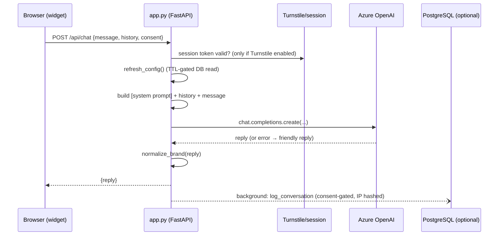

# 02 · Backend Architecture

> **Audience:** Backend / API engineers. How the server is structured, its service
> boundaries, API and database organization, security model, and scaling plan.
> **Last reviewed:** 2026-06-18 · **Owner:** AI Lab (ncr4ailab.de)

Terms are defined in the [Glossary](00-glossary.md). Source of truth: the
`backend/` directory.

---

## 1. Overview

The backend is a **stateless FastAPI service** (Python 3.13) that exposes the Navio
chatbot and contact form as an HTTP API. It holds all secrets and applies all safety
rules. Every external integration is **optional and isolated** behind its own module,
so the service runs with nothing but an Azure OpenAI key configured.

**Stack** (`backend/requirements.txt`): FastAPI + Uvicorn (HTTP), OpenAI SDK (Azure
endpoint), psycopg + psycopg-pool (PostgreSQL), slowapi (rate limiting), httpx
(outbound calls), PyJWT (Clerk verification), redis (optional shared counters),
python-dotenv (config).

---

## 2. Structure & module responsibilities

| File                          | Responsibility                                                                                                             | Optional? |
| ----------------------------- | ------------------------------------------------------------------------------------------------------------------------- | --------- |
| `app.py`                      | The FastAPI app: all HTTP endpoints, CORS, rate limiting, Turnstile + signed session tokens, input schemas/caps, AI-error mapping, brand normalization, config cache, conversation-log assembly. | — |
| `chatbot.py`                  | Standalone command-line chat loop for local testing of the prompt + model (not part of the web service).                  | — |
| `clerk_auth.py`               | Admin authentication: verify a Clerk session JWT (RS256 against JWKS), look up the user's verified email, authorize by email **domain** allowlist. | yes |
| `db.py`                       | PostgreSQL access: pooled connections, consent-gated conversation logging (fire-and-forget), editable-config read/write, IP hashing. | yes |
| `salesforce.py`               | Navio Plus contact form → Salesforce CaseHandler flow: OAuth (client_credentials) token caching, flow trigger with retry, SMTP fallback email. | yes |
| `test_salesforce.py`          | Tests for the Salesforce connector (seed of the test suite).                                                              | — |
| `prompts/SYSTEM_PROMPT.md`    | Navio's identity, tone, language rules, brand spelling, and the embedded knowledge base. The seed + offline fallback for the editable config. | — |
| `prompts/DATENSCHUTZ.md`      | Privacy/consent notice text (reference copy).                                                                             | — |
| `sql/schema.sql`              | The PostgreSQL schema (two tables) — run once on the server. Idempotent.                                                  | — |
| `cloudrun.env.yaml`           | Non-secret runtime config for Cloud Run.                                                                                  | — |
| `Dockerfile`                  | Container build (Python 3.13-slim → Uvicorn, with `--forwarded-allow-ips *`).                                             | — |

### Request lifecycle (the `/api/chat` path)

The database write is a **background task fired after the response is sent**, so DB
latency never adds to the visitor's wait, and a DB error can never crash the chat
(`db.log_conversation` swallows all exceptions).

---

## 3. Service boundaries & graceful degradation

Every integration is gated by an `*_enabled()` check and degrades safely. This is the
**graceful-degradation matrix** — what happens to each feature when a dependency is
absent:

| Integration            | Enabled when…                                    | Behaviour when **disabled**                                                                 |
| ---------------------- | ------------------------------------------------ | ------------------------------------------------------------------------------------------- |
| **Azure OpenAI** (required) | always (keys required at startup, fail-fast) | The service will not start without `AZURE_AI_CHATBOT_*` — it is the one hard dependency.     |
| **PostgreSQL**         | `DATABASE_URL` set (`db.db_enabled()`)           | No conversation logging; config falls back to the on-disk `SYSTEM_PROMPT.md` (admin edits write to disk). |
| **Salesforce**         | client id + secret set (`sf.salesforce_enabled()`) | `/api/contact` returns simulated success (`{"simulated": true}`) so the form stays demoable. |
| **SMTP fallback**      | `SMTP_HOST` set (`sf.smtp_enabled()`)            | On a Salesforce failure, the request is logged at ERROR level instead of emailed.           |
| **Clerk**              | `CLERK_ISSUER` set (`clerk_auth.clerk_enabled()`) | Admin auth falls back to the legacy shared `X-Admin-Token` header (empty token = open, dev only). |
| **Cloudflare Turnstile** | `TURNSTILE_SECRET` set (`TURNSTILE_ENABLED`)   | No bot check; `/api/session` still issues tokens but `/api/chat` does not require one.       |
| **Redis**              | `REDIS_URL` set                                  | Rate-limit counters are kept in-process memory (fine for a single instance).                |

**Design rule:** *required* dependencies fail fast at startup; *optional* ones
no-op or simulate. This keeps local dev and demos friction-free and makes partial
outages non-fatal.

---

## 4. API organization strategy

All endpoints are defined in `app.py`. The surface is intentionally small.

| Method & Path                  | Auth                                  | Rate limit               | Purpose                                                                 |
| ------------------------------ | ------------------------------------- | ------------------------ | ---------------------------------------------------------------------- |
| `GET /health`                  | none                                  | none                     | Liveness/readiness; reports model + which integrations are enabled.     |
| `POST /api/session`            | Turnstile token (if enabled)          | per-minute               | Verify the visitor is a real browser; mint a short-lived signed session token. |
| `POST /api/chat`               | valid session token (if Turnstile on) | per-minute **and** per-day | The main chat: system prompt + history + message → Azure OpenAI → reply. |
| `POST /api/contact`            | none (server holds SF secret)         | per-minute **and** per-day | Navio Plus contact form → Salesforce CaseHandler (with email fallback). |
| `GET /api/config`              | none (read-only)                      | none                     | Return the current system prompt + whether an auth layer is active.     |
| `POST /api/config/system-prompt` | Clerk JWT **or** `X-Admin-Token`    | none                     | Admin: replace the system prompt (persisted to DB or disk).             |

### Conventions for new endpoints
- **Validate at the edge.** Define a Pydantic request model with explicit field caps
  (see `ChatRequest`, `ContactRequest`). Never trust client-sent roles — only
  `user`/`assistant` turns are accepted; the `system` role is server-only.
- **Rate-limit anything public and costly** with `@limiter.limit(...)`; use the
  per-minute and per-day pair for AI/Salesforce-backed endpoints.
- **Map upstream errors to friendly responses**, not 500s, for anything user-facing
  (see `friendly_ai_reply`).
- **Keep integration calls in their module** (`db`, `salesforce`, `clerk_auth`), not
  inline in `app.py`.

### API versioning posture
The app is declared `version="1.0.0"` and paths are unversioned (`/api/...`). This is
fine for a single first-party consumer. **Recommendation:** when a breaking change to
the request/response contract becomes necessary, introduce a `/api/v2/...` prefix and
run both versions in parallel during migration, rather than mutating `/api/chat` in
place — the embeddable widget may be cached on third-party pages and cannot be forced
to update instantly.

---

## 5. Database organization strategy

The database is **optional** and deliberately minimal: it stores **no leads and no
bookings** — only the editable prompt and a conversation log (`sql/schema.sql`).

### Tables

**`bot_config`** — one row holds the editable system prompt.

| Column          | Notes                                              |
| --------------- | -------------------------------------------------- |
| `id` (PK)       | Always `'navio'` (single-row table today).         |
| `system_prompt` | The current prompt text.                           |
| `updated_at`    | Auto-refreshed on every update by a trigger.       |

**`conversations`** — one row per `/api/chat` request.

| Column                                            | Notes                                                       |
| ------------------------------------------------- | ----------------------------------------------------------- |
| `id` (PK)                                         | UUID (`gen_random_uuid()`).                                 |
| `session_id`                                      | Hashed session-token fingerprint (nullable).                |
| `bot_id`                                          | Defaults to `'navio'`.                                      |
| `consent`                                         | Whether the visitor accepted the privacy gate.              |
| `user_message`, `assistant_reply`                 | **Null unless `consent = true`** — text stored only with consent. |
| `history_len`, `latency_ms`                       | Context size and model round-trip time.                     |
| `prompt_tokens`, `completion_tokens`, `total_tokens` | Token usage for cost monitoring.                         |
| `model`, `finish_reason`                          | `gpt-4.1`; `stop`/`length`/`content_filter`/`error`.        |
| `ip_hash`                                         | `sha256(salt + ip)` — **never** the raw IP.                 |
| `created_at`                                      | Timestamp; indexed `desc` for recent-first queries.         |

**Indexes:** `conversations_created_at_idx` (recent-first) and
`conversations_bot_id_idx` (per-bot filtering).

### Privacy & retention
- **Consent-gated text:** message columns are null without consent (`app.py._log_row`).
- **Hashed IPs only:** `db.hash_ip` returns `sha256(salt + ip)` truncated; the raw IP
  is never stored.
- **No Row-Level Security:** unlike the previous Supabase design, only the backend
  ever connects, with full credentials and no exposed anon key — so RLS is
  unnecessary (`schema.sql` header).
- **Optional 90-day purge:** an opt-in `pg_cron` job deletes rows older than 90 days
  (documented in `schema.sql`).

### Connection strategy
- **Pooled, lazy connections** (`psycopg_pool`, `min_size=0`) so an unconfigured or
  briefly-unreachable database never blocks startup.
- **PgBouncer port (6432)** is used in the connection string so many serverless
  instances don't exhaust PostgreSQL's connection limit (`db.py` docstring).

### Conventions for schema changes
- Keep migrations **idempotent** (`create table if not exists`, `create index if not
  exists`) — `schema.sql` is safe to re-run.
- Update the explicit `_CONV_KEYS` tuple in `db.py` in lockstep with any new
  `conversations` column, so the parameterized INSERT can never desync.
- Treat "no leads, no bookings" as a privacy invariant — new tables need an explicit
  privacy justification.

---

## 6. Security considerations (decision + justification)

| Control                       | How                                                                                              | Why                                                                 |
| ----------------------------- | ----------------------------------------------------------------------------------------------- | ------------------------------------------------------------------- |
| **Secrets server-side**       | Azure key, DB URL, Salesforce, Clerk secret in env / Secret Manager; never shipped to browser.  | A browser secret is a public secret.                                |
| **CORS allowlist**            | `ALLOWED_ORIGINS` restricts who may call the API (SportNavi domains by default).                | Stops arbitrary sites from driving the AI endpoint.                 |
| **Rate limiting**             | Per-IP minute + day caps via `slowapi`; shared via Redis across instances; real IP from `X-Forwarded-For`. | Protects budget and availability from scraping/abuse.    |
| **Bot protection**            | Optional Cloudflare Turnstile on `/api/session`; passing it mints an HMAC-signed, expiring session token required by `/api/chat`. | Raises the cost of automated abuse without a CAPTCHA wall. |
| **Input caps**                | Pydantic field limits: message ≤ 2000 chars, ≤ 10 history turns; client roles limited to user/assistant. | Bounds payload size and prevents prompt-injection via a fake `system` turn. |
| **Admin authZ**               | Clerk JWT (RS256, JWKS-verified) + verified-email **domain** allowlist; legacy `X-Admin-Token` fallback. | Only trusted staff can change Navio's behaviour.                    |
| **Graceful AI errors**        | Content-filter/400 → polite refusal; transient errors → "try again" — never a raw 500.          | Safety and UX: abusive prompts and hiccups don't leak stack traces. |
| **GDPR**                      | Consent-gated text + hashed IPs + optional retention purge.                                      | Legal compliance and user trust.                                    |

**Session token mechanics** (`app.py`): a token is `"<expiry>.<hmac>"` signed with
`SESSION_SECRET`; validity is checked with a constant-time comparison and an expiry
check. The token is never stored — only a short hash of it groups a visitor's turns in
the log.

---

## 7. Scalability & maintainability

- **Stateless → horizontal scale.** No in-process session state; the browser supplies
  history. Any instance serves any request; scale by adding instances.
- **Config caching with TTL.** Each instance caches the prompt and re-reads the DB at
  most every `CONFIG_TTL_SEC` (default 30s), so admin edits propagate within seconds
  across all instances without a redeploy.
- **Connection pooling.** Shared, lazily-opened pool; `min_size=0` keeps startup cheap
  and serverless-friendly.
- **Shared rate limits.** Redis makes per-IP limits correct when multiple instances
  run; in-memory is fine for one.
- **Fire-and-forget logging.** Monitoring never degrades UX — DB writes happen after
  the response and swallow errors.
- **Where complexity lives.** Orchestration and safety in `app.py`; each integration's
  quirks isolated in its module. Adding/replacing an integration touches one file.
- **Testing posture.** `test_salesforce.py` is the seed. **Recommendation:** grow
  coverage in priority order — (1) the API contract and input caps, (2) consent-gating
  of stored text, (3) rate-limit behaviour, (4) Salesforce success/failure/fallback,
  (5) Clerk JWT verification and domain allowlist. See
  [Project Structure → Testing](06-project-structure.md#7-testing-organization).

---

## 8. What changes here, and what triggers a doc update

Update this document when: an endpoint is added/changed, a new integration is added,
the database schema changes, or a security control changes. See
[Documentation Standards → Update triggers](07-documentation-standards.md#5-update-triggers).

---

**Next:** [Frontend Architecture](03-frontend-architecture.md) ·
[Infrastructure & Deployment](04-infrastructure-deployment.md)
