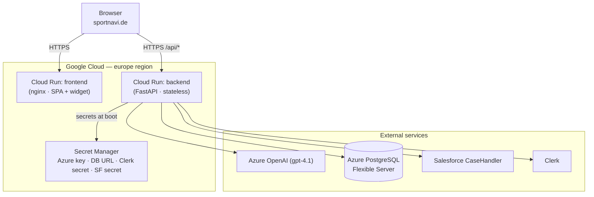
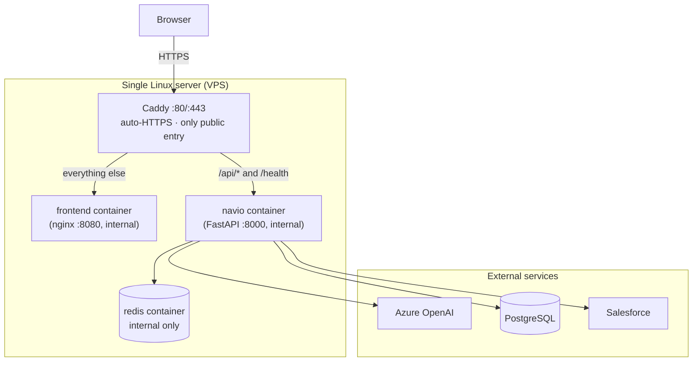

# 04 · Infrastructure & Deployment Architecture

> **Audience:** DevOps / Platform engineers (and decision-makers choosing a hosting
> model). Where Navio runs, how it is deployed, how the environments are organized,
> and how it is secured, monitored, backed up, and recovered.
> **Last reviewed:** 2026-06-18 · **Owner:** AI Lab (ncr4ailab.de)

Terms are defined in the [Glossary](00-glossary.md). The step-by-step runbook is
[`DEPLOY.md`](../../DEPLOY.md); this document is the architecture behind it.

---

## 1. Two deployment models

Navio supports two hosting models from the **same containers**. They are not
mutually exclusive — Cloud Run is the production default; the VPS model is a fully
documented alternative for cost or control reasons.

| Decision factor                | Choose **Cloud Run** (primary) when…                         | Choose **VPS** (alternative) when…                                  |
| ------------------------------ | ------------------------------------------------------------ | ------------------------------------------------------------------- |
| Traffic shape                  | Spiky or unpredictable; long idle periods                    | Steady, high, predictable volume                                    |
| Operational appetite           | You want minimal server management                           | You are comfortable managing a Linux box                            |
| Scaling                        | You want automatic scale-to-zero and burst scaling           | Fixed capacity is fine; you scale by worker count                   |
| Cost model                     | Pay-per-use, ~zero when idle                                 | Flat monthly server cost, cheaper at sustained load                 |
| TLS / certificates             | Managed by Google                                            | Managed automatically by Caddy                                      |
| Control over the host          | Not needed                                                   | You need full control of the OS/network                             |

Both models run the **identical** `backend/Dockerfile` and `frontend/Dockerfile`
images, so moving between them changes *where* containers run, not *what* they are.

---

## 2. Model A — Google Cloud Run (PRIMARY / CURRENT)

Two independent Cloud Run **services** in one GCP project, in a **European region**
(Frankfurt, appropriate for `sportnavi.de`).

- **Services:** `frontend` (static nginx serving `dist/` + `dist-widget/`) and
  `backend` (FastAPI). Both auto-scale, including **to zero** when idle.
- **Secrets** live in **Google Secret Manager**, wired in with `--set-secrets`:
  `AZURE_AI_CHATBOT_API_KEY`, `DATABASE_URL`, `CLERK_SECRET_KEY`,
  `SALESFORCE_CLIENT_ID`/`SALESFORCE_CLIENT_SECRET`.
- **Non-secret config** comes from [`backend/cloudrun.env.yaml`](../../backend/cloudrun.env.yaml)
  via `--env-vars-file` (Azure endpoint + deployment name, allowed origins, rate
  limits, message/token caps, Clerk issuer + admin domains, Salesforce URLs, fallback
  email).
- **The backend trusts the proxy's forwarded IP** (`Dockerfile` runs Uvicorn with
  `--forwarded-allow-ips *`) so rate limiting sees the real client IP.
- **Database** is **Azure Database for PostgreSQL (Flexible Server)**, reached via the
  PgBouncer port (6432) — see [Backend → Database](02-backend-architecture.md#5-database-organization-strategy).

> **Why two services rather than one?** The frontend is static and cacheable; the
> backend is dynamic and holds secrets. Splitting them lets each scale and deploy on
> its own cadence — see [Hosting Organization](05-hosting-organization.md).

---

## 3. Model B — VPS with Docker Compose + Caddy (ALTERNATIVE)

A single Linux server runs the whole stack with `docker-compose.yml`, fronted by
Caddy as the only public entry point. The repo already contains this configuration.

- **Caddy** (`Caddyfile`) terminates TLS (auto-issued from `NAVIO_DOMAIN`), gzip-
  encodes, routes `/api/*` and `/health` to `navio:8000`, and everything else to
  `frontend:8080`.
- **Redis** is enabled automatically (`REDIS_URL=redis://redis:6379` set in compose),
  giving correct shared rate limits across the worker processes; its counters are
  disposable (no persistence).
- **Workers:** `WEB_CONCURRENCY` (from `WORKERS`, default 2) sets the Uvicorn worker
  count — this is how you scale on a single box.
- **Secrets** come from a `.env` file loaded by the `navio` service (`env_file`).
- **Health:** the `navio` container has a Docker healthcheck hitting `/health`; Caddy
  waits for it to be healthy before starting.
- **Local dev convenience:** the backend port is published to `127.0.0.1:8000` so the
  Vite dev server can proxy to it; a pure production deploy can drop that.

---

## 4. Environment organization (dev / staging / production)

| Aspect              | Development                                   | Staging                                        | Production (Cloud Run)                          | Production (VPS)                              |
| ------------------- | --------------------------------------------- | ---------------------------------------------- | ----------------------------------------------- | -------------------------------------------- |
| **How it runs**     | `uvicorn app:app --reload` + `npm run dev`    | Same images as prod, separate service/host     | Two Cloud Run services                          | One server, `docker compose up`              |
| **Config source**   | `.env` (root) + `frontend/.env*`              | env file per environment                       | `cloudrun.env.yaml` + Secret Manager            | `.env` on the server                         |
| **Secret source**   | local `.env` (never committed)                | Secret Manager (separate secrets)              | Secret Manager                                  | `.env` (locked-down file perms)              |
| **Database**        | usually none (disk fallback) or a dev DB      | a staging DB                                    | Azure PostgreSQL (prod)                          | Azure PostgreSQL or self-hosted              |
| **Turnstile**       | off (`TURNSTILE_SECRET` empty)                | on (test keys)                                  | on                                              | on                                           |
| **Scaling**         | single process                                | minimal                                         | auto (incl. to zero)                            | `WEB_CONCURRENCY` workers                    |
| **Domains**         | `localhost`                                   | a staging subdomain                             | `sportnavi.de` / `navio.sportnavi.de`           | your `NAVIO_DOMAIN`                          |

**Recommendation:** keep a **staging environment that uses the production images and
configuration shape** (different secrets/DB), so a release is validated on the same
artifacts before promotion. Frontend dev relies on the Vite proxy (no CORS); staging
and prod use real origins under the `ALLOWED_ORIGINS` allowlist.

---

## 5. Networking & communication architecture

- **Single public entry per model.** Cloud Run exposes each service over managed
  HTTPS; the VPS exposes only Caddy (80/443) — internal services (`navio`, `frontend`,
  `redis`) are not reachable from the internet.
- **Request path:** browser → (Cloud Run service URL **or** Caddy) → frontend for the
  SPA/widget, backend for `/api/*` and `/health`.
- **CORS:** enforced by the backend via `ALLOWED_ORIGINS`; in dev the Vite proxy keeps
  requests same-origin so CORS is not exercised.
- **Forwarded IPs:** Uvicorn trusts `X-Forwarded-For` (`--forwarded-allow-ips *`) and
  the app reads the first hop as the client IP for rate limiting and hashing.
- **TLS termination:** Google (Cloud Run) or Caddy (VPS). Backends speak plain HTTP
  internally behind the proxy.

---

## 6. Security & operational considerations

| Area                  | Cloud Run                                                       | VPS                                                                  |
| --------------------- | -------------------------------------------------------------- | ------------------------------------------------------------------- |
| **Secret storage**    | Secret Manager (versioned, IAM-scoped)                         | `.env` file with strict permissions; consider a secrets agent       |
| **Secret rotation**   | New secret version → redeploy/revision                         | Update `.env` → `docker compose up -d`                              |
| **Identity / least privilege** | Per-service service accounts, minimal IAM roles      | OS users, firewall (allow only 80/443/SSH), key-only SSH, fail2ban  |
| **Image hygiene**     | Build from pinned bases; rebuild for CVEs                      | Same; plus keep the host OS patched                                 |
| **Network exposure**  | Only the service URLs are public                              | Only Caddy is public; everything else internal-only                 |
| **CORS / origins**    | `ALLOWED_ORIGINS` set per environment                         | Same                                                                |

**Shared rules:** never commit secrets (only `frontend/.env.production`'s *public*
Clerk key is committable); keep `ALLOWED_ORIGINS` tight; keep Turnstile on in
production.

---

## 7. Monitoring, logging, backup & recovery

| Concern             | Cloud Run                                                                 | VPS                                                                      |
| ------------------- | ------------------------------------------------------------------------ | ----------------------------------------------------------------------- |
| **Liveness**        | `/health` (reports model + which integrations are enabled)                | Same `/health`, also wired as the Docker `healthcheck`                  |
| **Logs**            | Cloud Logging (stdout/stderr captured automatically)                       | `docker compose logs -f navio` / ship to a log service                  |
| **Metrics**         | Built-in request count, latency, instance count                            | Container/host metrics via your monitoring agent                        |
| **App-level telemetry** | `conversations` table: latency, token usage, finish reason, per-bot   | Same (same database)                                                     |
| **DB backup**       | Azure PostgreSQL managed automated backups + point-in-time restore         | Same managed DB, or scheduled `pg_dump` if self-hosting Postgres        |
| **Retention**       | Optional `pg_cron` 90-day purge of `conversations` (`sql/schema.sql`)      | Same                                                                     |
| **Rollback**        | Redeploy/route to a previous Cloud Run **revision**                        | Rebuild from the previous image tag → `docker compose up -d`            |
| **Recovery**        | Stateless backend → just redeploy; data lives in the managed DB            | Re-provision the server, restore `.env`, `docker compose up -d`; restore DB from backup |

**Key resilience properties already in the design:**
- The backend is **stateless**, so instance loss is harmless — no session to recover.
- Conversation logging is **fire-and-forget and error-swallowing**, so a database
  outage degrades analytics, never the chat.
- The contact form has an **email fallback**, so a Salesforce outage never loses a
  request.
- Optional integrations **fail soft**, so a single dependency outage is contained.

---

## 8. Trade-off summary: Cloud Run vs VPS

| Dimension          | Cloud Run (primary)                    | VPS (alternative)                         |
| ------------------ | -------------------------------------- | ----------------------------------------- |
| Cost model         | Pay-per-use; ~zero idle                | Flat monthly; cheaper at sustained load   |
| Ops burden         | Low (managed)                          | Higher (you run the box)                  |
| Scaling            | Automatic, to zero and up              | Manual (worker count / bigger box)        |
| Control            | Limited host control                   | Full control                              |
| TLS                | Managed by Google                      | Automatic via Caddy                       |
| Complexity         | Two managed services                   | One server, four containers               |
| Best for           | Production with variable traffic       | Steady high volume or full-control needs  |

**Current recommendation:** stay on **Cloud Run** for production (it matches the
variable, public-facing traffic and minimal-ops goals), and keep the **VPS path
ready** as a documented fallback and for cost-sensitive steady-state scenarios.

---

**Next:** [Hosting Organization](05-hosting-organization.md) ·
[Project Structure](06-project-structure.md)
